# Measurement

## Overview 

The SMPS design includes output filtering on the positive and negative 12V rails, which is intended to attenuate switching noise. It's not clear that this is required: the switching frequencies of the dual-rail DCDC converter (265kHz) and the 5V buck converter (500kHz) are well outside any audible frequencies. This is an attempt to quantify the signals on the output rails.

The key quantities to validate are voltage, line regulation and ripple.

* line regulation
    * AP63301 will depend on resistor tolerance and thermals
    * REC30K will depend on load symmetry
        * symmetric: $\pm 0.1\%$ and $\pm 0.5\%$ typical on positive and negative rails, respectively
        * asymmetric (25%/100%): $\pm 5\%$ typical
* ripple voltage 
    * amplitude 
    * spectrum

The load conditions to test are

1. no load (open)
2. nominal load (100-120mA)
3. full load (1.0-1.2A)

For the REC30K, this should include symmetric (1:1) and asymmetric (4:1) conditions. Additionally, a test should be done with both converters operating at full load.

The image below shows the modifications to the v1.0 PCB and the test loads

* 2x $10\Omega$ (20W resistor)
* 1x $5\Omega$ (2 parallel $10\Omega$ 20W resistors)
* 2x $100\Omega$ (5W resistor)
* 1x $50\Omega$ (2 parallel $100\Omega$ 5W resistors)

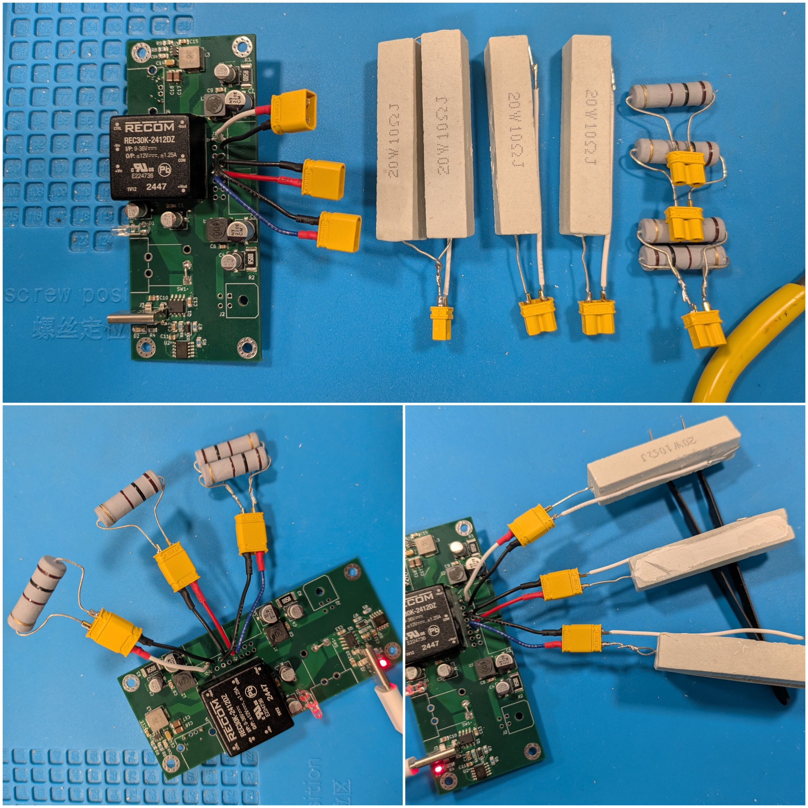

### Temperature

Temperature is measured using an IR thermometer at a distance of approximately 30cm from three targets:

1. Power-good enabled PMOS
2. REC30K case (see +/-12V line regulation results)
3. AP63301 package (see +5V line regulation results)

Temperature is measured after 10 minutes of operation under load and again at 20 minutes to confirm steady state. Temperatures are $\pm 5^\circ C$.

## Voltage and Line Regulation

The line regulation can be checked with a DMM: probe the average DC voltage. For the REC30K, 

* output accuracy (typ.): $\pm 2\%$ corresponds to $11.76 \leq V \leq 12.24$
* line regulation (typ.)
    * symmetric: $\pm 1\%$ corresponds to $0 \leq \Delta V \leq 0.12$
    * asymmetric: $\pm 5\%$ corresponds to $0 \leq \Delta V \leq 0.60$

| Test | +12V Load (mA) | +12V meas. (V) | -12V Load (mA) | -12V meas. (V) | T (C) |
|------|----------------|----------------|----------------|----------------|-------|
| 1    | 0              | 11.87          | 0              |  -12.03        | 30    |
| 2    | 120            | 11.88          | 120            |  -12.02        | 33    |
| 3    | 1200           | 11.83          | 1200           |  -12.00        | 72    |
| 4    | 240            | 11.87          | 1200           |  -11.50        | 57    |
| 5    | 1200           | 11.84          | 240            |  -12.73        | 61    |

**Note:** For the asymmetric tests, use a nominal load for the 5V rail.

**Note:** For the +/-12V rail, use a $100\Omega$ load for the nominal test (120mA, 3W) and a $10\Omega$ load for the full load test (1.2A, 30W). 

| Test | +5V Load (mA) | +5V meas. (V) | T (C) |
|------|---------------|---------------|-------|
| 1    | 0             | 4.98          | 30    |
| 2    | 100           | 4.98          | 40    |
| 3    | 1000          | 4.94          | 51    |

**Note:** For the +5V rail, use a $50\Omega$ (parallel $2\times 100\Omega$) load for the nominal test (100mA, 500mW) and a $5\Omega$ (parallel $2\times 100\Omega$) load for the full load test (1A, 5W).

## Ripple Voltage

### Probe Setup

Ripple voltage must be measured with an oscilloscope and a specific probe setup. Measuring ripple voltage accurately requires carefully avoiding the creation of a loop antenna with the probe tip and ground:

* Ground lead clip: do not use.
* Ground spring: I was not able to get the ground spring to work reliably. It picks up a lot of EMI unrelated to the switching noise in each of the following probe locations 
    * on IDC header PTHs (target location to probe ripple)
    * on mounting hole (away from switching elements, has stiched via ring to ground)
    * hovering over the PCB (radiated fields)
* Bridging posts: best quality measurement, no EMI. 
    * Bridge two posts with the probe tip and ground ring on the probe
    * Use single header pins in through-holes for connectors to make posts
* Shielded connector (e.g. BNC): not attempted (none placed on PCB).

To measure the ripple voltage, add posts (single header pins) at the +12V and -12V contacts for the IDC header and at the +5V and GND contact for the USB A connector (located near the 5V regulator). For the +/-12V reference, use the COM output pin of the REC30K. The image below shows the post locations and an example probe placement to measure ripple voltage in the v1.0 PCB. Note that the polarity of the probe doesn't matter for an AC-coupled measurement.

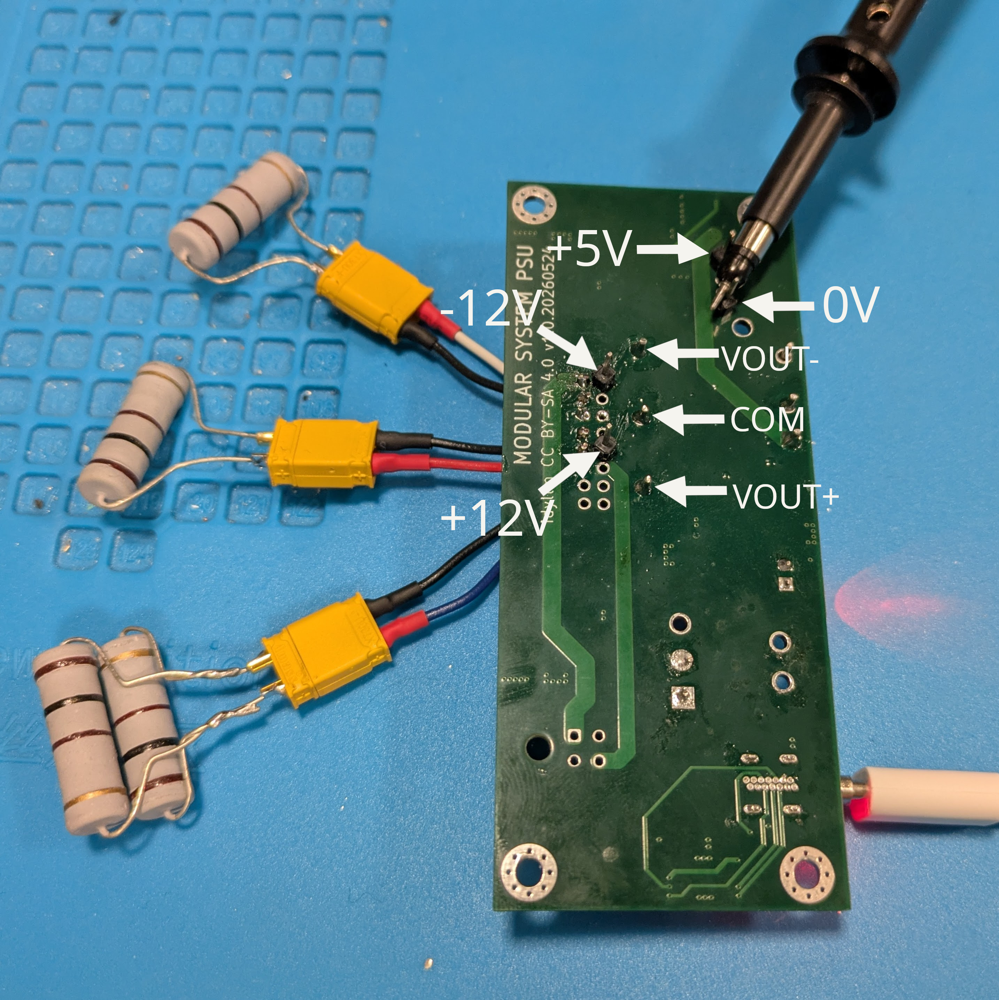{: width="640"}

Using this technique, 

* compare the unfiltered and filtered output from the DCDC converter. 
* check the ripple voltage at the +5V rail under no-, nominal- and full-load conditions
* check the ripple voltage at the +/-12V rail under no-, nominal- and full-load conditions

### Oscilloscope Configuration

Before probing ripple voltage, configure the oscilloscope as follows:

* check probe calibration (square wave test)
* oscilloscope input set to 20MHz bandwidth, AC coupling 
* probe and oscilloscope configured for 1X probing (do not use 10X -- extra bandwidth not required)

### Results (Nominal)

Under nominal load ($100\Omega$ on the +/-12V rails, $50\Omega$ on the 5V rail), the *unfiltered* output, measured across the +12V and COM outputs of the REC30K has a peak-to-peak of 42mV, which is within spec (80mVpp).

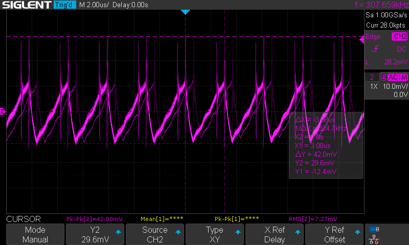

The primary harmonic is located at 320kHz (above the 265kHz in the spec sheet) with strong secondary and tertiary harmonics.

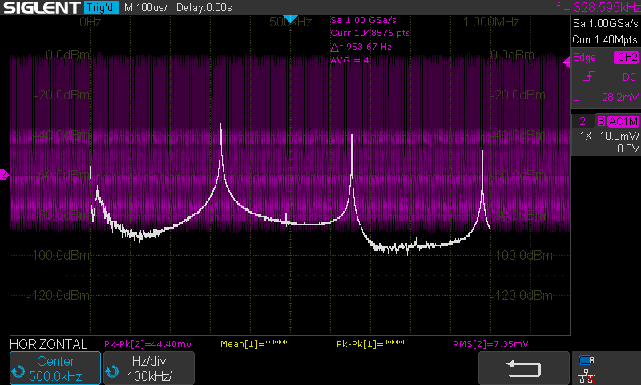

Next, probe the filtered +12V output using the COM pin of the REC30K as ground.

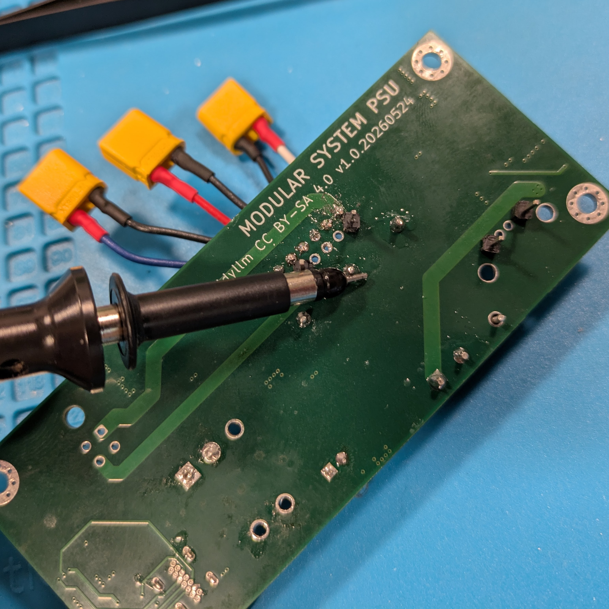{: width="640"}

The time signal shows a peak-to-peak ripple of 2mV and the spectrum shows that the 320kHz ripple has been attenuated by 40dBm (100x).

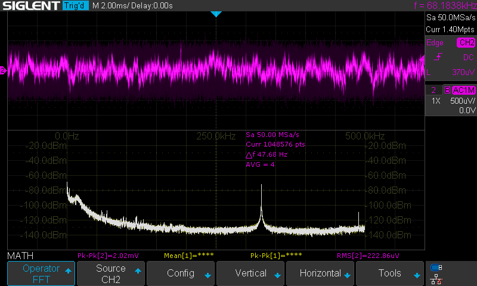

In the audio range, the spectrum shows a broad feature near 800Hz and a peak just above 4kHz with a second harmonic visible. The peak near 4kHz may be the resonance of the LC filter, although it is also visible in the 5V regulator spectrum.

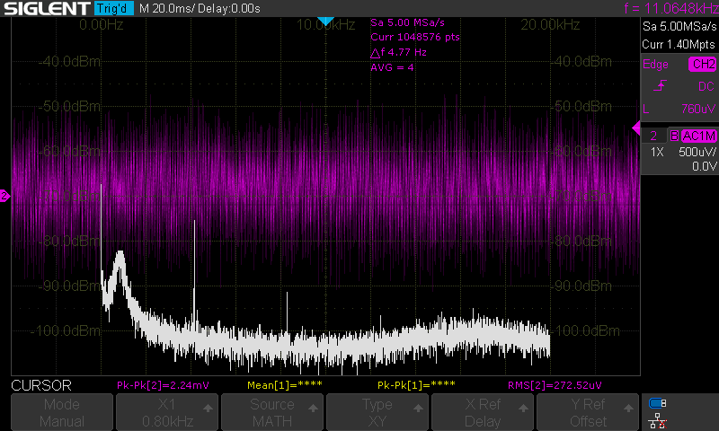

The +5V rail exhibits a 9mVpp ripple with the fundamental harmonic just below 500kHz (corresponding to the switching frequency of the AP63301). This is close to the design target of 10mVpp.

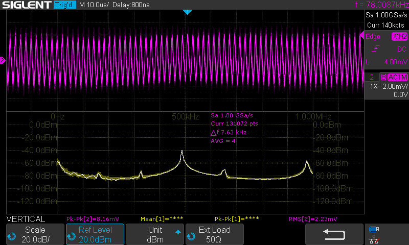

### Results (No Load)

With the loads removed, the +12V signal shows a peak-to-peak ripple of <1.5mV. The spectrum includes some lower frequency harmonics (110kHz, 220kHz) in addition to a signal near 330kHz, which may be due to pulse skipping in the regulator. All harmonics are attenuated below 100uVrms. 

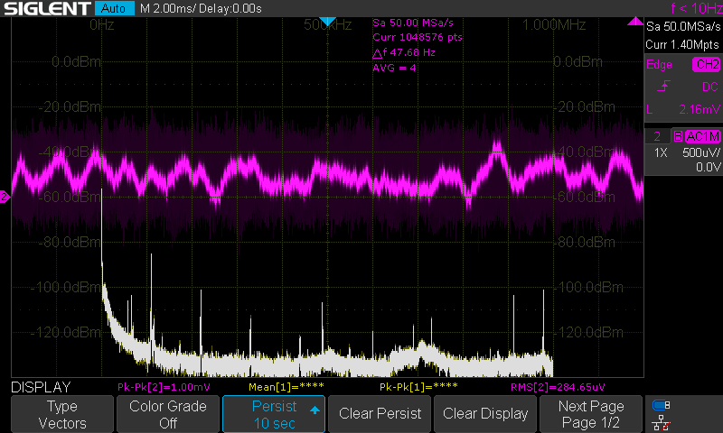

The unloaded +5V rail has a 10.8mVpp ripple and a clear spectral peak near 500kHz (the AP63301 switching frequency).

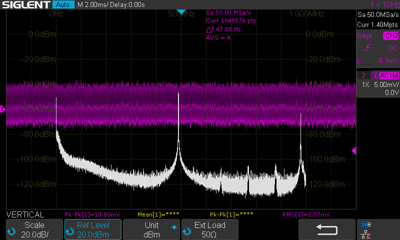

### Results (Full Load)

With full load conditions (1.2A from the +/-12V rails, 1A from the 5V rail), the filtered +12V signal peak-to-peak ripple increases to 7mV. The spectrum has a strong harmonic near 320kHz. 

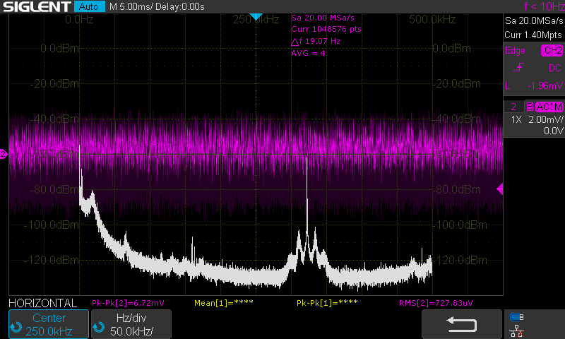

The fully loaded +5V rail has a 13mVpp ripple (30% over the 10mVpp target) and additional spectral peaks at 160kHz and 320kHz. A small peak shows up between 60 & 70kHz, which appears in the spectrum for the +12V rail as well and may be feed through from the USB-C adapter. 

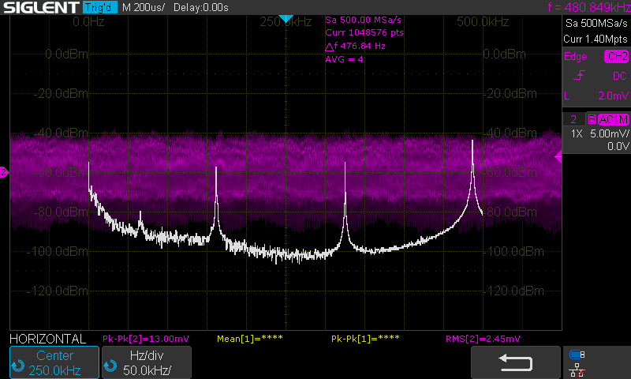

### USB Adapter Feedthrough 

Typical USB-C PD wall adapters (e.g. phone chargers) can have a significant impact on the ripple current as the switching noise from the adapter can be fed forward through the DCDC converters. 

The oscilloscope capture below illustrates the issue: on the +5V rail, the buck converter has an intrinsic ripple of approximately 9mVpp, but the wall adapter adds switching noise at approximately 35kHz bringing the peak-to-peak amplitude to over 40mV. Note that noise frames have a 120Hz rate, which likely corresponds to ACDC conversion using a full-wave rectified input from the 60Hz mains. 

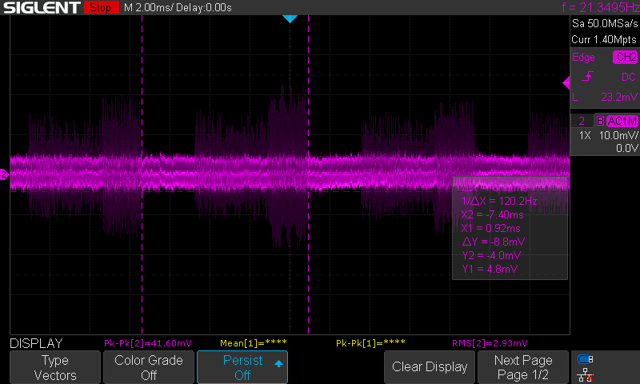

At the +12V filtered output, this 35kHz noise is attenuated slightly to 30mVpp. The energy content at the switching frequency is low: the induced transients include ringing at MHz frequencies, which is well outside of the audio range.

The measurements reported here use a different USB C adpater (a laptop charger) that does not exhibit the same switching noise (there are still some edges and transients visible at frequency of 28-30kHz, but they are within the peak-to-peak range of the filtered +12V ripple).
