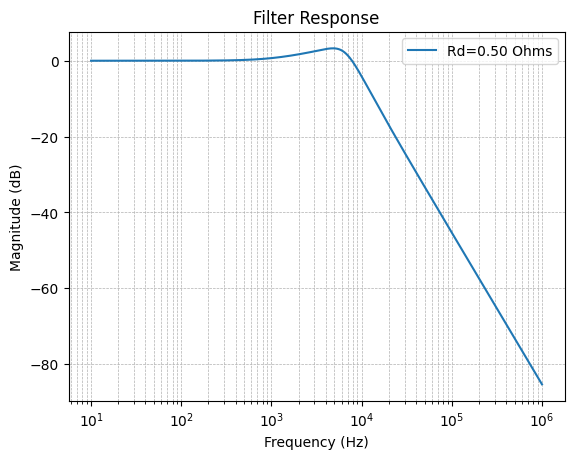

# Module Design

## Background 

This is the second version of a design that I came up with near the very beginning of this project. The original [design notes](./assets/archive/design.ipynb) are located in the archive folder in this project along with the [schematic](./assets/archive/schematic/Schematic_USBC-12V-PSU_2024-03-01.pdf), [layout files](./assets/archive/layout/Layout-USBC-12V-PSU_2024-03-01.pdf), and [BOM](./assets/archive/BOM_USBC-12V-PSU_2024-03-01.csv). 

The first version was based around a [CYPD3177](https://www.infineon.com/part/CYPD3177-24LQXQ) USB-C PD controller, which negotiated a minimum 15V supply from the USB port. If available, this was then passed to three DCDC converters:

* an inverting SMPS based on the [LT3757A](https://www.analog.com/media/en/technical-documentation/data-sheets/lt3757-3757a.pdf), delivering -12V at 1.25A
* an LDO [L7812](https://www.st.com/resource/en/datasheet/l78.pdf) to generate the +12V rail (1.25A)
* a buck converter based on the [AP63205](https://www.diodes.com/part/view/AP63205) delivering +5V at 1A

This worked successfully with only a couple of minor modifications:

* I originally intended to generate -15V with the inverting SMPS and use an LDO to clean it up and deliver -12V, which proved unnecessary (the -12V from the SMPS seemed fine).
* I reduced the minimum supply current requested by the USB-C PD controller so that I could tolerate more adapters

However, this design is very complex (it's the only one that I've had completely manufactured and populated by JLC), and when I ran out of these, I decided some design changes were worthwhile.

## Design Considerations

For the second version, there were a few design choices. For the DC converters, another choice worth considering is the [Meanwell RT65B](https://www.meanwell.com/Upload/PDF/RT-65/RT-65-SPEC.PDF): 120-240VAC in, +/-12VDC and +5VDC out with lots of power. The only drawback might be that the -12V rail is limited to 500mA, but if I had known about this the first time, there probably wouldn't be a second revision. However, to accommodate a USB-C input, I chose to continue with separate DCDC paths.

### SMPS?

I've built a +/-12V supply with a center-tapped transformer for 60Hz 120VAC, a full-wave rectifier, some beefy caps and linear regulators (and a buck converter for the 5V rail). This works fine: it's straightforward and very low noise. It also weights about 1kg and is wired right to mains. 

### Custom SMPS or Brick

**+/-12V Regulator**

There are several isolated DCDC converters that provide +/-12V, including 

* Meanwell [DKE15A-12](https://www.meanwellusa.com/upload/pdf/DKE15/DKE15-spec.pdf)
* Recom [REC30K-2412DZ](https://recom-power.com/pdf/Econoline/REC30K(-Z).pdf)

These have wide supply ranges (9-36V) and provide +/-12V outputs at 15-30W. Originally, I chose a custom design to control the noise in the output, but it's not likely that the complexity is worth it. A custom design likely comes with a modest BOM savings (the LT3757A is now in the $7 range for singles). 

Conclusion: REC30K-2412DZ and some output filtering (to be evaluated).

**+5V Regulator**

For the +5V supply, I considered keeping the previous design based on the AP63205, but decided to update to an [AP63301](https://www.diodes.com/part/view/AP63301) for a slight spec bump.

### Output Filtering

With an SMPS, there are a few options for output filtering to reduce voltage ripple

1. **None.** Good choice: the SMPS options all operate at switching frequencies above 200kHz, which is not audible. Other [designs](https://www.befaco.org/trolley-bus/) I've seen typically go this route.
2. **More bulk capacitors.** This requires some consideration of ESR, which can be mitigated somewhat with parallel arrangements. I used this in the original design, but didn't achieve low mV ripple.
3. **Passive LC low-pass filter.** These can significantly attenuate noise above 10kHz, but start to require large values with high current tolerance to bring the cutoff frequency lower. They also will have a resonance peak in the few kHz range that could potentially increase noise there. 
4. **Linear regulator.** These typically have good ripple rejection even at low frequencies (e.g. [LT3045](https://www.analog.com/media/en/technical-documentation/data-sheets/lt3045-ep.pdf) is better than 80dB for $f_{ripple} < 10\mathrm{kHz}$) and very low noise specs (in the uVs). The original design followed this approach: supply 15VDC from an adapter, and combine that with an inverting SMPS to generate a -13 to -15V rail before passing both rails through linear regulators. Power disipation is a concern (3V drop at 1.25A is almost 4W).

Conclusion: I implemented a passive output filter (option 3), but this could be considered an extra. More details in the design section.

### Supply Inputs

**USB-C** 

I wanted to keep the USB-C input, but considered expanding the range to support lower power adapters that supply 9V or 12V. However, I wanted to avoid requiring a microcontroller to pair with the USB-C PD controller.

* CYPD3177: it can be configured to negotiate for a min/max V with external resistors, but has a higher design complexity and only comes in a QFN package
* [CH224A](https://www.lcsc.com/datasheet/C42459160.pdf): the successor to the CH224K in the popular (cheap) PD trigger boards on aliexpress; no current negotiation and only supports a single voltage, comes in a SOP package.

Both options can be configured to only switch on the power path when a 15V supply is successfully negotiated, although this does not appear in the reference design for the CH224A. 

Conclusion: CH224A, 15V only (45W USB-C adapaters are relatively common and minimum current isn't a hard limit; assembly is easier with the CH224A). 

Note: the switching regulators in the USB-C wall adapters typically inject their own noise into the system, which is often at a lower frequency than the on-board SMPS. More details in the measurement section.

**Barrel Jack**

I thought about adding an optional barrel jack for a 9-20VDC supply. This required some power-OR'ing if side by side with the USB-C source, but not a large increase in part count. 12VDC adapters are fairly common, but it wasn't obvious how much better that was that just going with the USB-C.

Conclusion: no barrel jack option.

**Battery**

A portable rig? Exciting! Also, complicated, requiring

* a 3S lipo cell (11.6-12.6V)
* charging circuitry capable of boosting the input (particularly if 12V supplies are allowed)
* power prioritization to the Eurorack rails while plugged in
* additional power-OR'ing when the external supply is disconnected

A better alternative: an external 60W USB-C powerbank, which is cheaper than the battery.

Conclusion: no battery.

### Other Features

**On/Off Switch** 

Avoid plugging & unplugging the USB-C to switch the modular synth on and off. This turns out to have some options with tradeoffs

1. A physical switch after the USB-C PD negotiated 15V
2. A physical switch to enable/disable the onboard SMPS
3. A soft (electronic) switch to enable/disable the onboard SMPS

The first option requires a 5A-rated switch and downstream in-rush control to avoid resetting the power negotiation. The second option requires some quiescent wetting current to ensure contact reliability. The third option requires some additional circuitry that is 15V tolerant. 

Conclusion: option 2 (after trying option 1 and realizing that it didn't work). 

**USB-A Output**

This seemed like a nice one: use the 5V rail to supply up to 500mA (unregulated, shared with the Eurorack supply) if you want to plug a USB-A device in. This would enable connecting something like a keyboard (e.g. my Arturia Keystep). 

Conclusion: yes.

## Implementation

### USB-C Input

The [CH224A](https://www.lcsc.com/datasheet/C42459160.pdf) handles the USB-C PD negotiation and can be configured to request 15V with RSET=56k. It provides a "power good" (PG) pin in a common-drain configuration (active low), which is used to pull down the gate on a PMOS if the negotiation is successful. 

The PMOS is a [DMP3056LS](https://www.diodes.com/assets/Datasheets/ds31419.pdf)

* $V_{GSS,max} = \pm 20V$
* $V_{DSS,max} =  -30V$
* $I_{D,max} = -6A$
* $R_{DS(ON)} = 65m\Omega$
* $Q_{G} = 14nC$

The gate is pulled up to the source with a 22k resistor. A 12V Zener diode is added in parallel with the pull-up to protect the PMOS from exceeding $V_{GSS,max}$, and a 4.7k resistor is added in series between the gate and the PG pin on the CH224A to limit the current through the Zener and control the in-rush current. In-rush control is handled with a source-drain capacitor, which acts as a low-pass ($\tau = RC = 470\mu s$) for the gate signal. Additionally, the drain-gate capacitor limits the in-rush current by holding the gate up while the PMOS switches on. In sequence, 

1. 15V is negotiated by the PD controller
2. Before the PG signal (open-drain, active low) is applied, $V_{GS}=0 \to V_G = 15V$ and $V_{GD}= 15V$
3. When the PG pin is pulled low, the potential at the gate $V_G$ starts to drop (with rate set by $\tau=RC$) until $V_{GS} < -V_{th}$ the threshold voltage
4. When $V_{GS}$ reaches $-V_{th}$, the PMOS starts to conduct and $V_{GS}$ plateaus (current is diverted from charging $C_{gs}$). 

Consequently, the voltage change across $C_{gd}$ and the load capacitance $C_L$ is the same $dV/dt$, and the current into $C_L$ is approximately $I_L \simeq C_L/C_{gd} I_{Cgd}$. The current through $C_{gd}$ is approximately set by the current through the series gate resistance pulled to ground by the PG signal: $I_{Rg} = V_G/R_{g} = (15-V_{th})/R_{g}$ (only $V_{th}$ is dropped across the gate-drain pull-up resistor).

$$
\begin{align*}
V_{th} &= 1.7V \\
R_{g} &= 4.7k\Omega \\
\to I_{Cgd} \simeq I_{Rg} &\approx 3\mathrm{mA}
\end{align*}
$$

Assuming $C_L = 220\mu F$ (just a placeholder: actual loading will also depend on the soft-start characteristics of the DCDC converters), the peak in-rush current will be limited to

$$
\begin{align*}
I_L &= \frac{C_L}{C_{gd}} I_{Cgd} \approx 6.6A
\end{align*}
$$

This is approximate, but significantly below the pulse drain current limit for the DMP3056LSS (-20A). The design can be verified with a [circuit simulation](https://is.gd/N27wOD).

### Power Switch and Scheduling

**Dual Rail DCDC Converter**

A resistive divider sets the gate voltage of an NMOS (2N7002) to 7.5V when the switch is open. When the switch is closed, the upper resistor provides a wetting current for the switch and an extra C to ground is used to provide an extra kick. The NMOS is in an open-drain configuration, and pulls the SMPS enable to ground when the switch is open and $V_{GS} \simeq 7.5V$. When closed, $V_{GS} = 0V$, the NMOS shuts off and the SMPS enable is pulled high by an internal pull-up resistor. 

**Buck Regulator**

The 5V regulator is sequenced downstream of the +/-12V rails: The +12V rail pulls the 5V regulator enable high, turning it on after the +12V rail has come up. 

### Dual +/-12V DCDC Converter

The data sheet for the [REC30K-2412DZ](https://recom-power.com/pdf/Econoline/REC30K(-Z).pdf) indicates a typical ripple current of 80mVp-p and a switching frequency of 265kHz. The ripple current is measured with a conservative capacitive loading (10uF in parallel with 100n). 

While the switching frequency is well outside the audio range, for this design I've added a second order resonant (LC) low-pass filter (e.g. "parallel damped filter" in ref. [1](#input-filter-design)). The design is detailed in the [notebook](./notebook.ipynb): choosing 

* $C=47\mu F$ ($25V$)
* $L=10\mu H$ ($2A$, $40m\Omega$)

and adding a series damped capacitor ($C_d = 220\mu F$, $R_d=500m\Omega$) yields the transfer function plotted below.

This filter has a slight resonance (3dB peak) at 4.8kHz and over 60dB of attenutation at the switching frequency. 

### 5V Buck Converter

The design for the 5V buck converter comes directly from the [AP63301 datasheet](https://www.diodes.com/part/view/AP63301). The inductor value for the buck regulator is related to the switching frequency and ripple current:

$$ 
L = \frac{V_{out}\left(V_{in} - V_{out}\right)}{V_{in} \Delta I_L f_{sw}}
$$

Selecting $L=6.8\mu H$ and using $f_{sw} = 500kHz$, $V_{out}=5V$, and $V_{in} = 15V$, the ripple current is $\Delta I_{L}=1A$, which is consistent with the datasheet recommendation to pick $\Delta I_{L}$ between 30% and 50% of the maximum load (3A). Therefore, the peak current in the inductor will be (using a conservative $I_{load}=2A$)

$$
I_{L,max} = I_{load} + \frac{\Delta I_L}{2} = 2 + 0.5 = 2.5A
$$

The selected inductor (MGAH06036R8M-10) is rated to 5A with a max. DCR of $50m\Omega$.

The output capacitance is related to the output ripple:

$$
\Delta V_{out} = \Delta I_L \left(R_{C,ESR} + \frac{1}{8 f_{sw} C_{out}}\right)
$$

The capacitance derating at a 5V DC bias can exceed 60%. Typical ESR plots ([example](https://pim.murata.com/en-global/pim/details/?partNum=GRM31CR61C476ME44L)) show very low ESRs near the switching frequency ($<5m\Omega$), which can be reduced further by connecting capacitors in parallel. For a ripple voltage below 10mV, choose $2\times 47\mu F$ 16V capacitors with $ESR<3m\Omega$.

## References

1. "Input Filter Design for Switching Power Supplies", App. Note SNVA538, TI, [ti.com](https://www.ti.com/lit/an/snva538/snva538.pdf)
2. "Low-Noise and Low-Ripple Techniques for a Supply Without an LDO", App. Note SLUP409, TI, [ti.com](https://www.ti.com/lit/ml/slup409c/slup409c.pdf) 